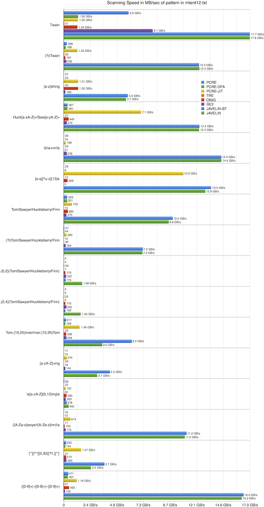

# JavelinPattern v0.1

JavelinPattern is a regular expression engine which aims to be fast _and_ feature rich.

There is also a pre-built OSX binary for [ag (the_silver_searcher)](https://github.com/jthlim/the_silver_searcher) that uses JavelinPattern.

## Features

- JavelinPattern is _fast_
- Multiple internal processing engines
- Supports sub-match capturing
- Supports minimal/maximal/possessive quantifiers
- Supports unicode case folding
- JavelinPattern really is _fast_...
- Supports offline pattern compilation
- Supports positive and negative lookaheads, lookbehinds
- Supports conditional and recursive regexes
- JIT for back tracking x64 and arm64 engine
- Automatic stack guarding for x64 (configurable auto-stack growth or fail match)
- Threadsafe -- patterns can be used on multiple threads concurrently
- Support for glob syntax patterns
- ... did I mention it is _fast_ ?

## Performance

JavelinPattern has a number of internal engines that it uses depending on the pattern
provided. To be feature rich, it has a back-tracking engine that provides look-aheads,
look-behinds, conditional regexes and other features. If you use one of these features,
the back tracking engine will automatically be chosen. In other situations, the pattern
compiler will try and determine the most effective engine to handle the supplied pattern.

Test machine: Macbook Pro Retina Mid 2012, 2.6 GHz Intel Core i7, OSX El Capitan 10.11.4 using code modified from here: [Performance comparison of regular expression engines](http://sljit.sourceforge.net/regex_perf.html)

Javelin-BT is the performance when the `JP_OPTION_PREFER_BACK_TRACKING` flag is set. The following table is the time taken (in milliseconds) to scan [mtent12.txt](http://www.gutenberg.org/files/3200/old/mtent12.zip) -- a text file approximately 20MB in size.

|                                        |  PCRE-DFA | PCRE-JIT |     ONIG |      RE2 | JAVELIN-BT | JAVELIN |
| -------------------------------------- | --------: | -------- | -------: | -------: | ---------: | ------: |
| Twain                                  |        15 | 15       |       16 |        2 |          1 |       1 |
| (?i)Twain                              |       106 | 16       |      120 |       84 |          2 |       2 |
| [a-z]shing                             |       881 | 15       |       15 |      121 |          3 |       4 |
| Huck[a-zA-Z]+\|Saw[a-zA-Z]+            |        56 | 3        |       45 |       73 |          2 |       2 |
| \b\w+nn\b                              |      1240 | 101      |      970 |       72 |          1 |       1 |
| [a-q][^u-z]{13}x                       |      2515 | 2        |       56 |     4175 |          1 |       2 |
| Tom\|Sawyer\|Huckleberry\|Finn         |        62 | 27       |       52 |       74 |          2 |       2 |
| (?i)Tom\|Sawyer\|Huckleberry\|Finn     |       451 | 77       |      562 |      109 |          3 |       3 |
| .{0,2}(Tom\|Sawyer\|Huckleberry\|Finn) |      4726 | 334      |      118 |       85 |        114 |      12 |
| .{2,4}(Tom\|Sawyer\|Huckleberry\|Finn) |      5905 | 367      |      118 |       80 |        124 |      13 |
| Tom.{10,25}river\|river.{10,25}Tom     |       119 | 14       |       85 |       81 |          3 |       6 |
| [a-zA-Z]+ing                           |      1978 | 73       |     1090 |      138 |          5 |       7 |
| \s[a-zA-Z]{0,12}ing\s                  |       911 | 105      |       77 |      100 |         72 |      45 |
| ([A-Za-z]awyer\|[A-Za-z]inn)\s         |      1336 | 33       |      201 |      116 |          2 |       2 |
| ["'][^"']{0,30}[?!\.]["']              |       130 | 13       |       94 |       77 |          5 |       8 |
| ([0-9]+)-([0-9]+)-([0-9]+)             |        50 | 17       |       41 |      167 |          1 |       1 |
| **TOTAL**                              | **20479** | **1210** | **3661** | **5554** |    **342** | **109** |



Note: Graph based on µs resolution measurements

## API

Check [JavelinPattern.h](JavelinPattern.h) to see the list of available functions (It's very brief)

Example code snippet:

```c
#include "JavelinPattern.h"

{
  jp_pattern_t pattern;
  int result = jp_pattern_compile(&pattern, "test(\\w+)", JP_OPTION_IGNORE_CASE | JP_OPTION_UTF8);
  if(result != 0) ...

  const void* captures[4];
  if(jp_partial_match(pattern, data, strlen(data), captures, 0))
  {
     // captures[0] contains start of match (inclusive)
	 // captures[1] contains end of match (exclusive)
	 // captures[2] contains start of \w+ subgroup match
	 // captures[3] contains end of \w+ subgroup match
  }

  jp_pattern_free(pattern);
}

```

## Supported Patterns

| Pattern         | BT Only | Meaning                                                   |
| --------------- | ------- | --------------------------------------------------------- |
| (...)           |         | Capture                                                   |
| (?:...)         |         | Cluster                                                   |
| (?_x_)          |         | Option change ('i', 's', 'm', 'u', 'U')                   |
| (?#...)         |         | Comment                                                   |
| (?=...)         | Y       | Positive look-ahead                                       |
| (?!...)         | Y       | Negative look-ahead                                       |
| (?\<=...)       | Y       | Positive look-behind                                      |
| (?\<!...)       | Y       | Negative look-behind                                      |
| (?\>...)        | Y       | Atomic group                                              |
| (?(_c_)_t_:_f_) | Y       | Conditional regex                                         |
| (?R)            | Y       | Recursive regex                                           |
| (?1)            | Y       | Recursive to capture group 1                              |
| (?-_n_)         | Y       | Recursive to relative capture group                       |
| (?+_n_)         | Y       | Recursive to relative capture group                       |
| \|              |         | Alternation                                               |
| .               |         | Any character                                             |
| ^               |         | Start of line                                             |
| $               |         | End of line                                               |
| \\a             |         | Alarm (ASCII 0x07)                                        |
| \\A             |         | Start of input                                            |
| \\b             |         | Word boundary                                             |
| \\B             |         | Not word boundary                                         |
| \\c*X*          |         | Control-_X_                                               |
| \\C             |         | Any byte                                                  |
| \\d             |         | Digit                                                     |
| \\D             |         | Not digit                                                 |
| \\e             |         | Escape (ASCII 0x1b)                                       |
| \\f             |         | Form feed (ASCII 0x0c)                                    |
| \\G             |         | Start of search                                           |
| \\h             |         | Horizontal whitespace                                     |
| \\K             |         | Reset capture                                             |
| \\n             |         | Newline (ASCII 0x0a)                                      |
| \\Q...\\E       |         | Treat ... after \\Q as a literal until \\E is encountered |
| \\r             |         | Carriage Return (ASCII 0x0d)                              |
| \\s             |         | Whitespace                                                |
| \\S             |         | Not whitespace                                            |
| \\t             |         | Horizontal tab (ASCII 0x09)                               |
| \\u*####*       |         | Unicode 4-hex digits                                      |
| \\u{_###_}      |         | Unicode hex                                               |
| \\v             |         | Vertical tab (ASCII 0x0b)                                 |
| \\w             |         | Word character                                            |
| \\W             |         | Not word character                                        |
| \\x##           |         | 2 hex digits                                              |
| \\x{_###_}      |         | Unicode hex                                               |
| \\z             |         | End of input                                              |
| \\1             | Y       | Back reference                                            |
| \\\\            |         | Backslash                                                 |
| [...]           |         | Character set (ranges supported)                          |
| [^...]          |         | Not character set (ranges supported)                      |
| [[:*xxx*:]]     |         | POSIX character class _xxx_, eg `lower`, `alpha`          |

| Quantifiers | BT Only | Meaning                          |
| ----------- | ------- | -------------------------------- |
| \*          |         | 0 or more maximal                |
| \*?         |         | 0 or more minimal                |
| \*+         | Y       | 0 or more possessive             |
| \+          |         | 1 or more maximal                |
| \+?         |         | 1 or more minimal                |
| \++         | Y       | 1 or more possessive             |
| ?           |         | 0 or 1 maximal                   |
| ??          |         | 0 or 1 minimal                   |
| ?+          | Y       | 0 or 1 possessive                |
| {###}       |         | Exactly ### times                |
| {M,N}       |         | Between M and N times maximal    |
| {M,N}?      |         | Between M and N times minimal    |
| {M,N}+      | Y       | Between M and N times possessive |
| {M,}        |         | At least M times maximal         |
| {M,}?       |         | At least M times minimal         |
| {M,}+       | Y       | At least M times possessive`     |
| {,N}        |         | At most M times maximal          |
| {,N}?       |         | At most M times minimal          |
| {,N}+       | Y       | At most M times possessive`      |
